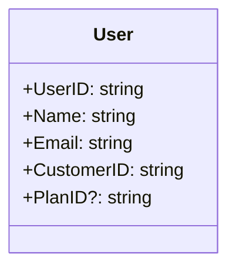

```mermaid
classDiagram
    class User {
        <!-- 一意の識別子 -->
        +UserID: string
        <!-- 名前 -->
        +Name: string
        <!-- メールアドレス -->
        +Email: string
        <!-- ユーザーに関連付けられた決済顧客ID -->
        +CustomerID: string
        <!-- ユーザーの加入しているサブスクプラン名 -->
        +PlanID?: string
    }
```
